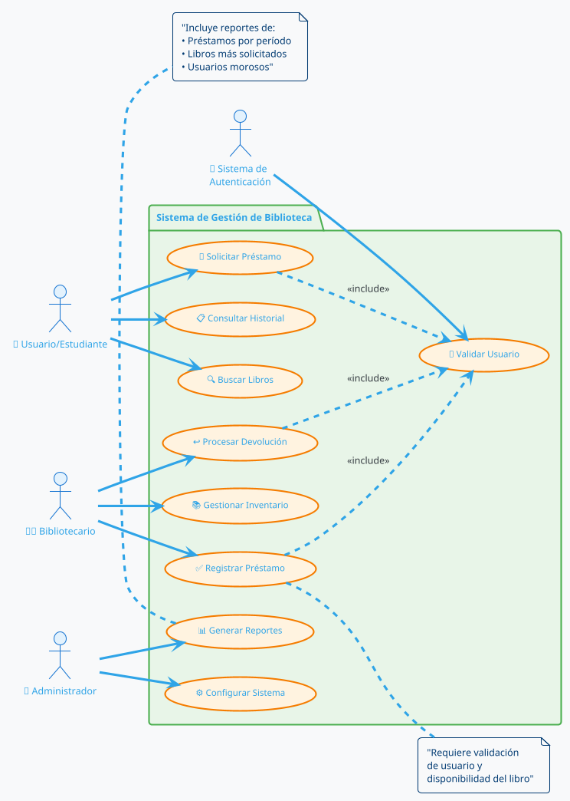
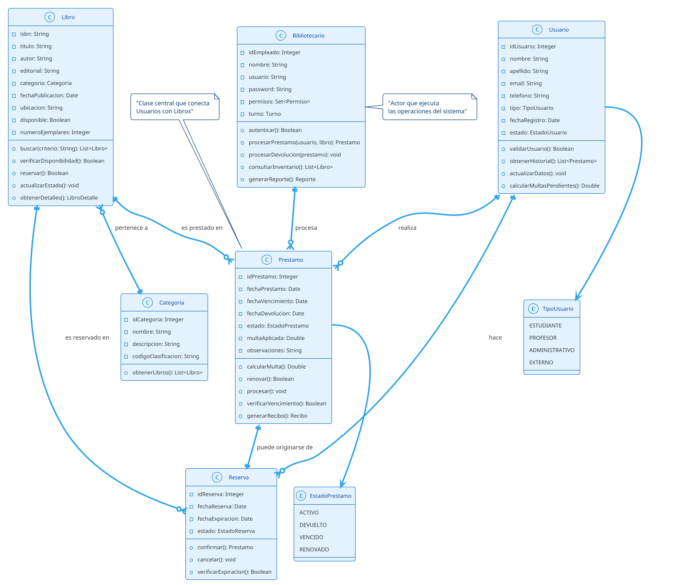
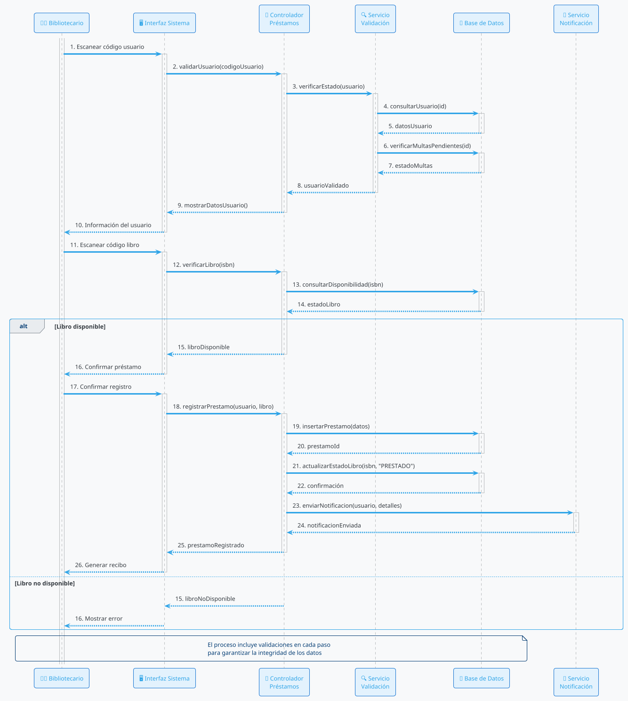
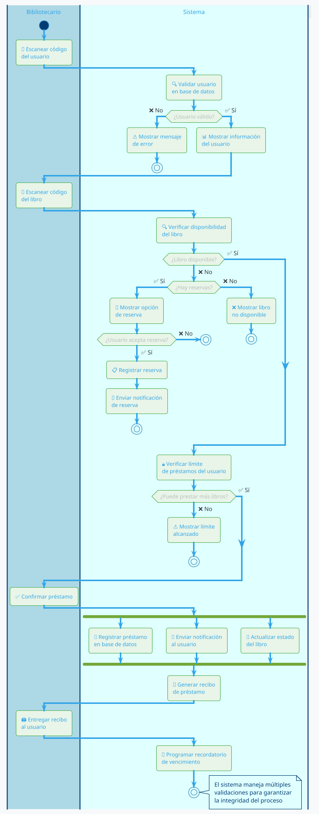
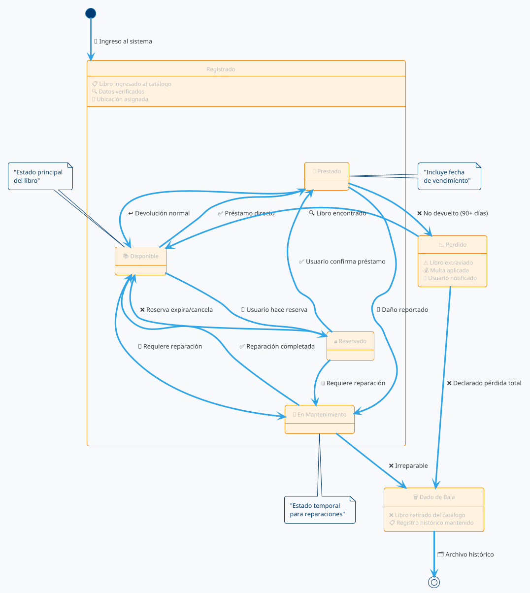
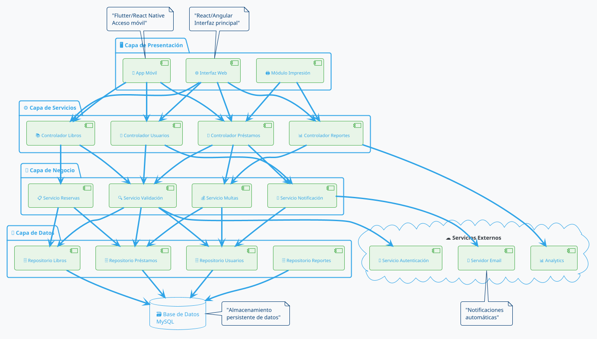
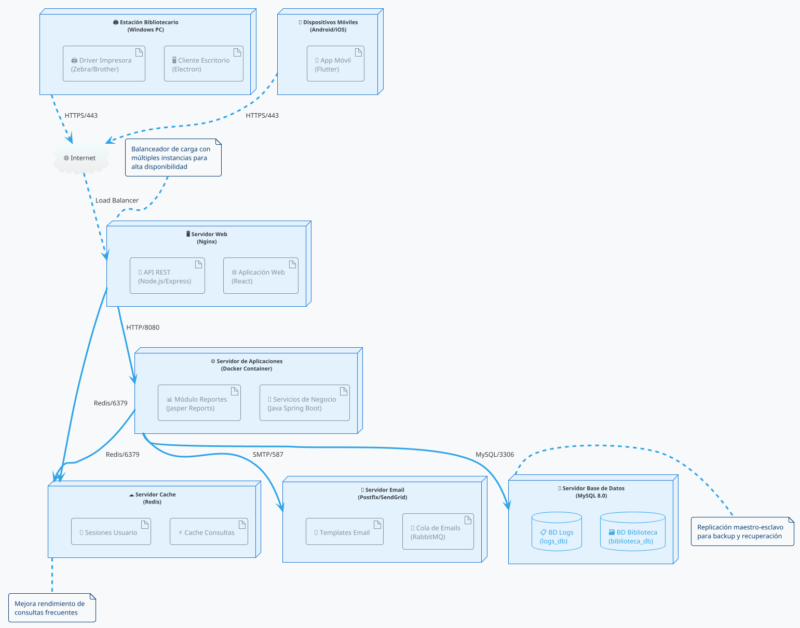
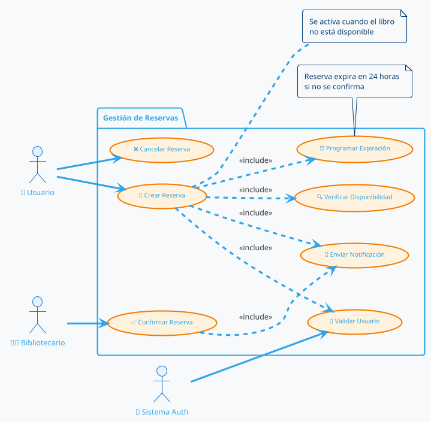
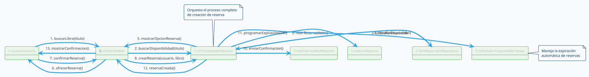

# Metodología RUP (Rational Unified Process): Enfoque Moderno para el Desarrollo de Software

## 1. Introducción y Definiciones Fundamentales

### ¿Qué es RUP?

El **Rational Unified Process (RUP)** es una metodología de desarrollo de software iterativo e incremental que proporciona un enfoque disciplinado para asignar tareas y responsabilidades dentro de una organización de desarrollo. RUP se caracteriza por ser:

- **Iterativo e Incremental**: El desarrollo se realiza en ciclos cortos llamados iteraciones
- **Centrado en la Arquitectura**: Enfoque temprano en la definición de la arquitectura del sistema
- **Dirigido por Casos de Uso**: Los casos de uso guían todo el proceso de desarrollo
- **Controlado por Riesgos**: Identificación y mitigación temprana de riesgos

### Definiciones Clave

**Iteración**: Ciclo de desarrollo completo que resulta en una versión ejecutable del producto que es un subconjunto del producto final.

**Incremento**: Diferencia entre las versiones de dos iteraciones sucesivas.

**Caso de Uso**: Descripción de una secuencia de acciones que un sistema realiza para proporcionar un resultado observable de valor para un actor.

**Actor**: Rol que representa una entidad externa (persona, sistema, dispositivo) que interactúa con el sistema.

**Artefacto**: Pieza de información que es producida, modificada o utilizada por un proceso.

**Flujo de Trabajo (Workflow)**: Secuencia de actividades que produce un resultado observable de valor.

## 2. Las Cuatro Fases de RUP

### Fase 1: Inicio (Inception)
**Objetivo**: Establecer la visión del proyecto y determinar su viabilidad.

**Actividades Principales**:
- Definición del alcance del proyecto
- Identificación de actores y casos de uso principales
- Análisis de riesgos iniciales
- Estimación de recursos y cronograma
- Desarrollo del caso de negocio

**Artefactos Clave**:
- Documento de Visión
- Modelo de Casos de Uso inicial
- Glosario
- Plan del Proyecto
- Evaluación de Riesgos

### Fase 2: Elaboración (Elaboration)
**Objetivo**: Definir la arquitectura del sistema y establecer una base sólida para el desarrollo.

**Actividades Principales**:
- Captura y análisis detallado de requisitos
- Diseño de la arquitectura del sistema
- Prototipado de funcionalidades críticas
- Planificación detallada de iteraciones
- Mitigación de riesgos principales

**Artefactos Clave**:
- Especificación de Requisitos de Software (SRS)
- Documento de Arquitectura de Software
- Casos de Uso detallados
- Prototipos arquitectónicos
- Plan de Iteraciones

### Fase 3: Construcción (Construction)
**Objetivo**: Completar el desarrollo del sistema basándose en la arquitectura definida.

**Actividades Principales**:
- Implementación iterativa e incremental
- Pruebas unitarias y de integración
- Refinamiento de requisitos
- Gestión de cambios
- Preparación para el despliegue

**Artefactos Clave**:
- Código fuente
- Ejecutables del sistema
- Documentación de usuario
- Casos de prueba
- Manuales de instalación

### Fase 4: Transición (Transition)
**Objetivo**: Entregar el producto terminado a los usuarios finales.

**Actividades Principales**:
- Pruebas beta con usuarios reales
- Despliegue en producción
- Capacitación de usuarios
- Soporte post-implementación
- Evaluación del proyecto

**Artefactos Clave**:
- Sistema en producción
- Documentación de usuario final
- Material de capacitación
- Informe de cierre del proyecto

## 3. Los Nueve Flujos de Trabajo de RUP

### Flujos de Trabajo Principales:

1. **Modelado del Negocio**: Comprensión de la organización y sus procesos
2. **Requisitos**: Captura, análisis y validación de requisitos del sistema
3. **Análisis y Diseño**: Transformación de requisitos en diseño del sistema
4. **Implementación**: Construcción del sistema a través de código
5. **Pruebas**: Verificación y validación del sistema
6. **Despliegue**: Distribución del sistema a los usuarios finales

### Flujos de Trabajo de Soporte:

7. **Gestión de Configuración y Cambios**: Control de versiones y cambios
8. **Gestión del Proyecto**: Planificación y seguimiento del proyecto
9. **Entorno**: Provisión de herramientas y procesos de desarrollo

## 4. Visión Moderna de RUP

### Adaptaciones Contemporáneas

En el contexto actual del desarrollo de software, RUP ha evolucionado para mantenerse relevante:

#### 4.1 Integración con Metodologías Ágiles
- **RUP Ágil**: Combinación de la estructura de RUP con principios ágiles
- **Iteraciones más cortas**: De 2-4 semanas en lugar de 2-6 meses
- **Mayor colaboración**: Énfasis en la comunicación directa sobre documentación extensa
- **Entrega continua**: Implementación de prácticas DevOps

#### 4.2 Herramientas Modernas
- **Herramientas CASE**: IBM Rational Suite, Enterprise Architect
- **IDEs Integrados**: Eclipse, IntelliJ IDEA, Visual Studio
- **Control de Versiones**: Git, SVN con integración continua
- **Gestión de Proyectos**: Jira, Azure DevOps, Trello

#### 4.3 Arquitecturas Contemporáneas
- **Microservicios**: Aplicación de RUP en arquitecturas distribuidas
- **Cloud Computing**: Adaptación para desarrollo en la nube
- **Arquitecturas Orientadas a Servicios (SOA)**
- **API-First Development**

#### 4.4 Enfoque en DevOps
- **Integración Continua/Despliegue Continuo (CI/CD)**
- **Automatización de pruebas**
- **Monitoreo y observabilidad**
- **Infraestructura como código**

## 5. Ejemplo Completo: Sistema de Gestión de Biblioteca

### Descripción del Sistema
Desarrollaremos un sistema para gestionar el préstamo de libros en una biblioteca universitaria, siguiendo la metodología RUP moderna.

### Fase 1: Inicio

#### Documento de Visión
**Propósito**: Automatizar el proceso de préstamo, devolución y gestión del inventario de libros en la biblioteca.

**Objetivos**:
- Reducir el tiempo de proceso de préstamos en 70%
- Mejorar el control del inventario
- Facilitar la búsqueda de libros para usuarios
- Generar reportes automáticos para la administración

#### Identificación de Actores
- **Bibliotecario**: Gestiona préstamos, devoluciones e inventario
- **Usuario/Estudiante**: Busca y solicita préstamo de libros
- **Administrador**: Configura el sistema y genera reportes
- **Sistema de Autenticación**: Sistema externo para validar usuarios

#### Casos de Uso Principales
1. Registrar préstamo de libro
2. Procesar devolución de libro
3. Buscar libros en el catálogo
4. Gestionar inventario de libros
5. Generar reportes de uso

### Fase 2: Elaboración

#### Casos de Uso Detallados

**Caso de Uso: Registrar Préstamo de Libro**

- **Actor Principal**: Bibliotecario
- **Precondiciones**: 
  - Usuario autenticado en el sistema
  - Libro disponible en inventario
- **Flujo Principal**:
  1. Bibliotecario escanea código de usuario
  2. Sistema muestra información del usuario
  3. Bibliotecario escanea código del libro
  4. Sistema verifica disponibilidad
  5. Sistema registra préstamo con fecha de vencimiento
  6. Sistema imprime recibo
- **Postcondiciones**: 
  - Préstamo registrado en base de datos
  - Estado del libro cambiado a "prestado"

#### Diagramas UML Principales

**Diagrama de Casos de Uso del Sistema:**



**Diagrama de Clases Principal:**



#### Arquitectura del Sistema

**Patrón Arquitectónico**: MVC (Modelo-Vista-Controlador) con arquitectura de 3 capas

**Componentes Principales**:
- **Capa de Presentación**: Interfaces web y móvil
- **Capa de Lógica de Negocio**: Servicios de negocio y controladores
- **Capa de Datos**: Base de datos y repositorios

### Fase 3: Construcción

#### Iteración 1: Funcionalidades Básicas
**Duración**: 3 semanas
**Objetivos**:
- Implementar autenticación de usuarios
- Desarrollar búsqueda básica de libros
- Crear interfaz de usuario principal

**Actividades**:
1. Configuración del entorno de desarrollo
2. Implementación de la base de datos
3. Desarrollo de servicios de autenticación
4. Creación de interfaces básicas
5. Pruebas unitarias

#### Iteración 2: Gestión de Préstamos
**Duración**: 3 semanas
**Objetivos**:
- Implementar proceso de préstamo
- Desarrollar proceso de devolución
- Integrar notificaciones

#### Iteración 3: Funcionalidades Avanzadas
**Duración**: 3 semanas
**Objetivos**:
- Sistema de reportes
- Gestión de inventario
- Optimizaciones y refinamientos

#### Diagramas de Secuencia

**Diagrama de Secuencia: Proceso de Préstamo**



#### Diagrama de Actividades

**Flujo de Proceso de Préstamo:**



### Fase 4: Transición

#### Diagrama de Estados - Ciclo de Vida del Libro



#### Diagrama de Componentes - Arquitectura del Sistema



#### Diagrama de Despliegue - Arquitectura Física



#### Plan de Despliegue
1. **Pruebas de Aceptación**: Con bibliotecarios y usuarios piloto
2. **Despliegue Gradual**: Por departamentos o facultades
3. **Capacitación**: Sesiones para bibliotecarios y usuarios
4. **Monitoreo**: Seguimiento del rendimiento post-implementación

#### Métricas de Éxito
- Reducción del tiempo de préstamo: 70% logrado
- Satisfacción del usuario: > 85%
- Disponibilidad del sistema: > 99%
- Reducción de errores manuales: > 90%

### Diagramas Complementarios del Sistema de Biblioteca

#### Diagrama de Casos de Uso Detallado - Gestión de Reservas



#### Diagrama de Colaboración - Proceso de Reserva



## 6. Diagramas UML Utilizados en RUP

### Diagramas Estructurales
1. **Diagrama de Clases**: Estructura estática del sistema
2. **Diagrama de Objetos**: Instancias específicas en tiempo de ejecución
3. **Diagrama de Componentes**: Organización de componentes del software
4. **Diagrama de Despliegue**: Arquitectura física del sistema

### Diagramas de Comportamiento
1. **Diagrama de Casos de Uso**: Funcionalidades del sistema
2. **Diagrama de Secuencia**: Interacciones temporales entre objetos
3. **Diagrama de Actividades**: Flujo de trabajo y procesos
4. **Diagrama de Estados**: Ciclo de vida de objetos

## 7. Herramientas Modernas para RUP

### Herramientas de Modelado
- **Enterprise Architect**: Modelado UML completo
- **IBM Rational Software Architect**: Herramienta integrada de IBM
- **Visual Paradigm**: Herramienta de modelado colaborativa
- **Lucidchart**: Diagramación en línea colaborativa

### Herramientas de Desarrollo
- **IDEs**: IntelliJ IDEA, Eclipse, Visual Studio Code
- **Control de Versiones**: Git con GitHub/GitLab/Bitbucket
- **CI/CD**: Jenkins, Azure DevOps, GitHub Actions
- **Testing**: JUnit, TestNG, Selenium, Postman

### Herramientas de Gestión
- **Jira**: Gestión de proyectos y seguimiento de issues
- **Confluence**: Documentación colaborativa
- **Trello**: Gestión visual de tareas
- **Slack/Teams**: Comunicación del equipo

## 8. Ventajas de RUP en el Contexto Moderno

### Escalabilidad
RUP se adapta tanto a proyectos pequeños como grandes empresariales, permitiendo personalizar el proceso según las necesidades específicas.

### Trazabilidad
Mantiene una clara trazabilidad desde requisitos hasta código, facilitando el mantenimiento y la evolución del software.

### Gestión de Riesgos
El enfoque iterativo permite identificar y mitigar riesgos tempranamente, reduciendo la probabilidad de fallos del proyecto.

### Calidad del Software
La integración de pruebas y revisiones en cada iteración asegura la calidad continua del producto.

### Documentación Equilibrada
Aunque flexible, RUP mantiene la documentación necesaria sin caer en el exceso, adaptándose a las necesidades del proyecto.

## 9. Desafíos y Consideraciones

### Curva de Aprendizaje
RUP requiere capacitación y experiencia para ser implementado efectivamente, especialmente en equipos nuevos.

### Overhead en Proyectos Pequeños
Para proyectos muy pequeños, la estructura de RUP puede ser excesiva, requiriendo adaptación.

### Necesidad de Herramientas
La implementación efectiva de RUP se beneficia significativamente de herramientas especializadas, lo que puede implicar costos adicionales.

## 10. Conclusiones

RUP mantiene su relevancia en el desarrollo moderno de software gracias a su capacidad de adaptación y su enfoque estructurado. Su combinación con prácticas ágiles, herramientas modernas y arquitecturas contemporáneas lo convierte en una opción viable para proyectos que requieren:

- Documentación y trazabilidad rigurosas
- Gestión efectiva de riesgos
- Desarrollo iterativo controlado
- Arquitecturas sólidas y escalables

La clave del éxito con RUP moderno radica en adaptar el proceso a las necesidades específicas del proyecto y del equipo, manteniendo sus principios fundamentales mientras se integra con las mejores prácticas contemporáneas del desarrollo de software.

## 11. Instrucciones para Usar PlantUML Localmente

### Instalación de PlantUML

#### Opción 1: PlantUML con Java
1. **Descargar PlantUML**: Obtén el archivo `plantuml.jar` desde [plantuml.com](https://plantuml.com/download)
2. **Instalar Java**: Asegúrate de tener Java 8+ instalado
3. **Usar desde línea de comandos**:
   ```bash
   java -jar plantuml.jar diagram.puml
   ```

#### Opción 2: Extensiones de VSCode
1. **PlantUML**: Extensión oficial para VSCode
2. **PlantUML Preview**: Vista previa en tiempo real
3. **Configuración**: Añade la ruta de PlantUML en settings.json

#### Opción 3: Herramientas Online
- **PlantText.com**: Editor online sin instalación
- **PlantUML.com**: Servidor oficial
- **Kroki.io**: Servicio de diagramas como código

### Exportar Diagramas

```bash
# SVG (Recomendado para calidad)
java -jar plantuml.jar -tsvg diagram.puml

# PNG (Para documentos)
java -jar plantuml.jar -tpng diagram.puml

# PDF (Para presentaciones)
java -jar plantuml.jar -tpdf diagram.puml
```

### Mejores Prácticas

1. **Organización**: Mantén cada diagrama en archivos separados
2. **Versionado**: Usa Git para controlar versiones de los diagramas
3. **Nomenclatura**: Usa nombres descriptivos (`use-case-biblioteca.puml`)
4. **Temas**: Aplica temas consistentes (`!theme cerulean-outline`)
5. **Documentación**: Incluye comentarios explicativos en el código PlantUML

### Integración con Documentación

- **Markdown**: Incluye diagramas directamente en documentos
- **Confluence**: Plugin disponible para Atlassian
- **Wiki**: Integración con GitHub/GitLab wikis
- **Presentaciones**: Exporta a formatos compatibles con PowerPoint

Con estos diagramas PlantUML profesionales, el manual de RUP ahora proporciona una visualización clara y profesional del ejemplo práctico de gestión de biblioteca, facilitando la comprensión de los conceptos y su aplicación práctica.