# Manual Práctico de UML para Analistas de Sistemas

## Tabla de Contenidos

1. [Introducción a UML](#introducción-a-uml)
2. [Conceptos Fundamentales](#conceptos-fundamentales)
3. [Diagramas de Estructura](#diagramas-de-estructura)
4. [Diagramas de Comportamiento](#diagramas-de-comportamiento)
5. [Diagramas de Interacción](#diagramas-de-interacción)
6. [PlantUML: Herramienta Práctica](#plantuml-herramienta-práctica)
7. [Metodología de Análisis con UML](#metodología-de-análisis-con-uml)
8. [Buenas Prácticas](#buenas-prácticas)
9. [Casos de Estudio](#casos-de-estudio)
10. [Referencias y Recursos](#referencias-y-recursos)

---

## Introducción a UML

### ¿Qué es UML?

**UML (Unified Modeling Language)** es un lenguaje de modelado visual estándar utilizado para especificar, construir, visualizar y documentar sistemas de software. Desarrollado por Grady Booch, James Rumbaugh e Ivar Jacobson en los años 90, UML se ha convertido en el estándar de facto para el modelado orientado a objetos.

### Objetivos de UML

- **Visualización**: Proporcionar un lenguaje visual para expresar modelos
- **Especificación**: Crear modelos precisos, no ambiguos y completos
- **Construcción**: Permitir la generación de código a partir de modelos
- **Documentación**: Facilitar la comunicación entre equipos de desarrollo

### Versiones de UML

- **UML 1.x**: Versiones iniciales (1997-2005)
- **UML 2.x**: Versión actual con importantes mejoras estructurales
- **UML 2.5.1**: Versión más reciente (2017)

---

## Conceptos Fundamentales

### Elementos Básicos de UML

#### 1. Elementos Estructurales
- **Clases**: Descripción de objetos con atributos y operaciones similares
- **Interfaces**: Contrato que especifica operaciones sin implementación
- **Componentes**: Partes físicas y reemplazables del sistema
- **Nodos**: Elementos físicos que existen en tiempo de ejecución

#### 2. Elementos de Comportamiento
- **Interacciones**: Comportamientos que comprenden mensajes entre objetos
- **Máquinas de Estado**: Comportamiento que especifica secuencias de estados

#### 3. Elementos de Agrupación
- **Paquetes**: Mecanismo organizacional para agrupar elementos

#### 4. Elementos de Anotación
- **Notas**: Comentarios explicativos adjuntos a elementos

### Relaciones en UML

#### 1. Dependencia
Una relación donde un elemento depende de otro.
```
Cliente -.-> Servicio : usa
```

#### 2. Asociación
Relación estructural que describe vínculos entre objetos.
```
Persona -- Empresa : trabaja en
```

#### 3. Generalización (Herencia)
Relación donde un elemento especializado es sustituible por uno general.
```
Vehiculo <|-- Automovil
```

#### 4. Realización
Relación donde un elemento implementa otro.
```
interface Volador
class Avion
Volador <|.. Avion
```

---

## Diagramas de Estructura

### 1. Diagrama de Clases

**Propósito**: Mostrar la estructura estática del sistema mediante clases, interfaces y sus relaciones.

**Elementos principales**:
- Clases con atributos y métodos
- Interfaces
- Relaciones (asociación, herencia, composición, agregación)

**Ejemplo PlantUML**:
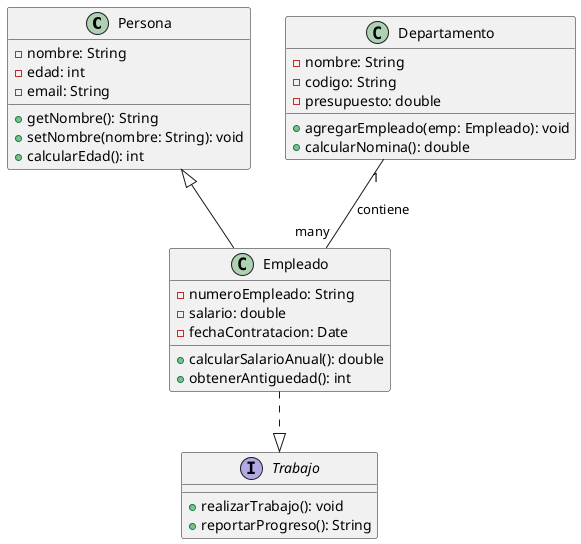

**Multiplicidades**:
- `1`: Exactamente uno
- `0..1`: Cero o uno
- `*` o `0..*`: Cero o muchos
- `1..*`: Uno o muchos
- `n..m`: Entre n y m

### 2. Diagrama de Objetos

**Propósito**: Mostrar instancias específicas de clases en un momento determinado.

**Ejemplo PlantUML**:
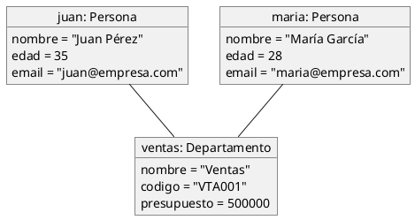

### 3. Diagrama de Componentes

**Propósito**: Mostrar la estructura y dependencias entre componentes de software.

**Ejemplo PlantUML**:
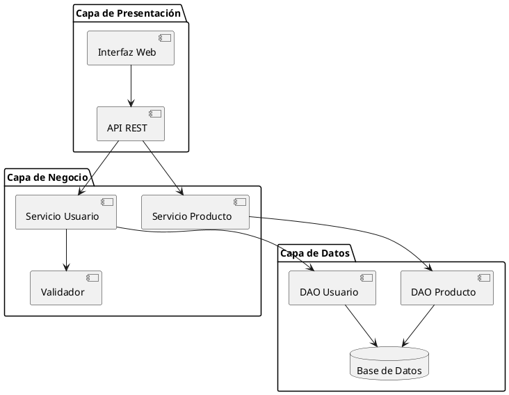

### 4. Diagrama de Despliegue

**Propósito**: Mostrar la arquitectura física del sistema y la distribución de componentes.

**Ejemplo PlantUML**:
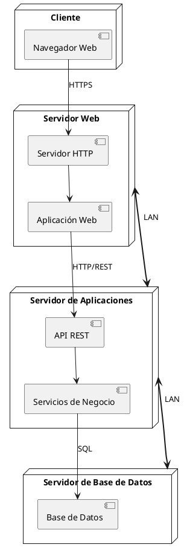

### 5. Diagrama de Paquetes

**Propósito**: Organizar elementos del modelo en grupos relacionados.

**Ejemplo PlantUML**:
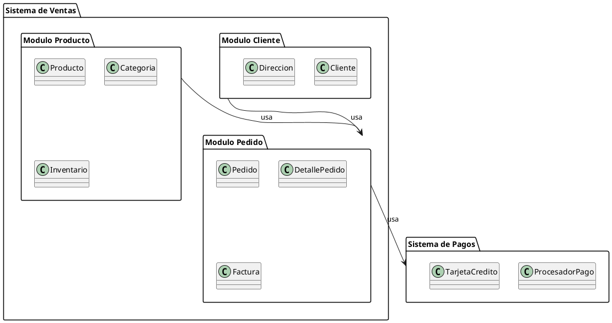

---

## Diagramas de Comportamiento

### 1. Diagrama de Casos de Uso

**Propósito**: Describir la funcionalidad del sistema desde la perspectiva del usuario.

**Elementos principales**:
- **Actores**: Usuarios externos del sistema
- **Casos de Uso**: Funcionalidades específicas
- **Relaciones**: Include, extend, generalización

**Ejemplo PlantUML**:
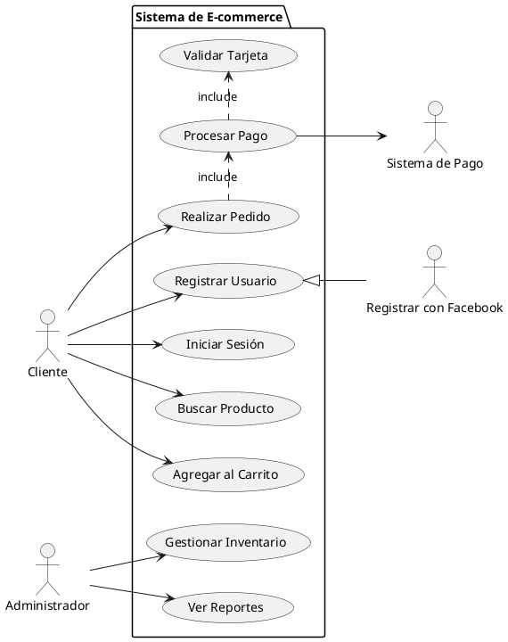

**Relaciones en Casos de Uso**:
- **Include**: `<<include>>` - Funcionalidad que siempre se ejecuta
- **Extend**: `<<extend>>` - Funcionalidad opcional
- **Generalización**: Especialización de casos de uso

### 2. Diagrama de Actividades

**Propósito**: Modelar el flujo de trabajo y procesos de negocio.

**Ejemplo PlantUML**:
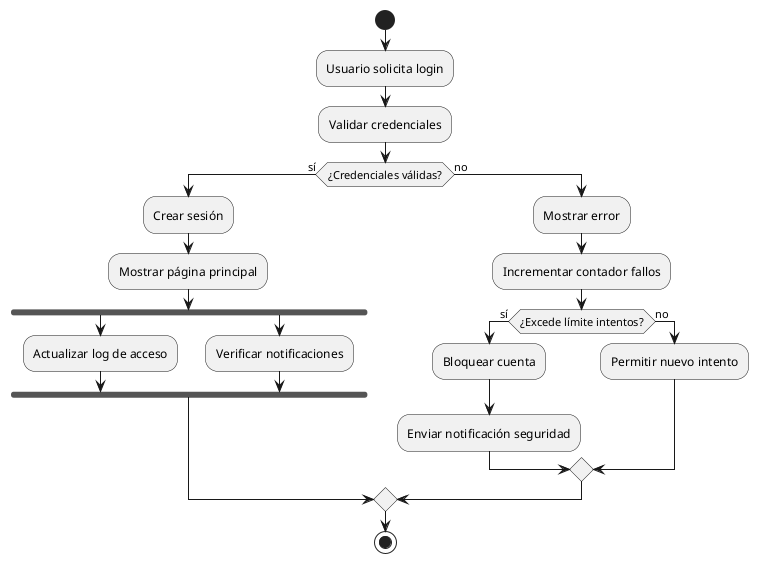

**Elementos del Diagrama de Actividades**:
- **Nodo inicial**: Inicio del flujo
- **Nodo final**: Fin del flujo
- **Actividad**: Paso del proceso
- **Decisión**: Punto de bifurcación
- **Merge**: Punto de unión
- **Fork**: División paralela
- **Join**: Unión de flujos paralelos

### 3. Diagrama de Estados

**Propósito**: Mostrar los estados de un objeto y las transiciones entre ellos.

**Ejemplo PlantUML**:
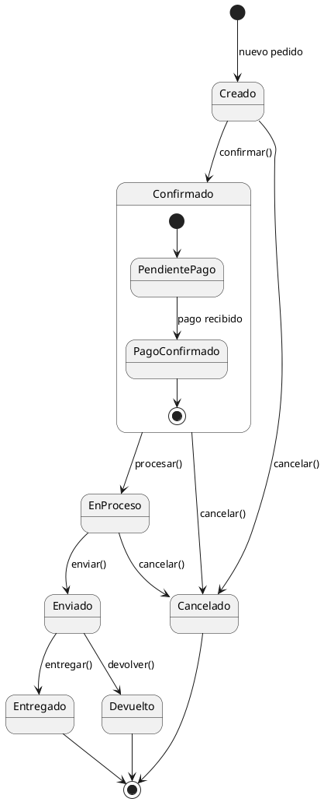

---

## Diagramas de Interacción

### 1. Diagrama de Secuencia

**Propósito**: Mostrar la interacción entre objetos a lo largo del tiempo.

**Ejemplo PlantUML**:
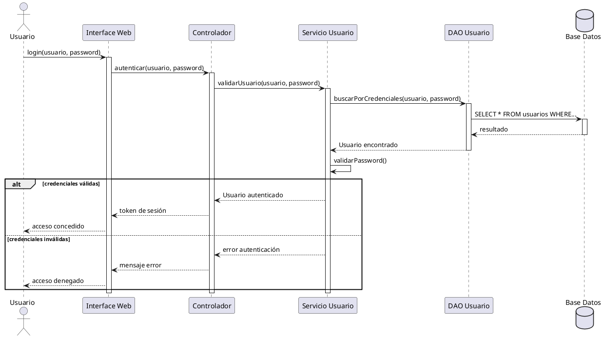

**Elementos del Diagrama de Secuencia**:
- **Participantes**: Objetos o actores
- **Línea de vida**: Línea vertical que representa la existencia
- **Mensajes**: Flechas que representan comunicación
- **Activación**: Rectángulo que muestra cuando un objeto está activo
- **Fragmentos combinados**: alt, opt, loop, par, etc.

### 2. Diagrama de Comunicación

**Propósito**: Mostrar interacciones entre objetos enfocándose en la estructura.

**Ejemplo PlantUML**:
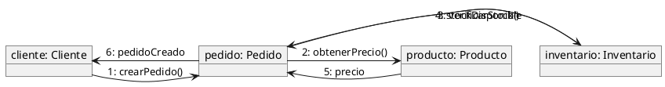

### 3. Diagrama de Tiempo

**Propósito**: Mostrar cambios de estado a lo largo del tiempo.

**Ejemplo PlantUML**:
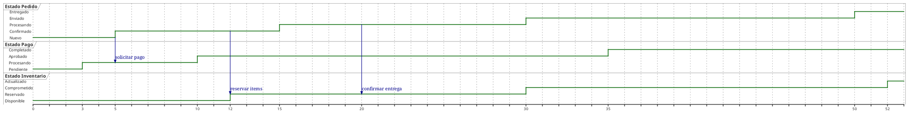

---

## PlantUML: Herramienta Práctica

### Instalación y Configuración

#### Prerequisitos
```bash
# Java Runtime Environment
java -version

# Graphviz (para algunos diagramas)
sudo apt-get install graphviz  # Linux
brew install graphviz          # macOS
```

#### Instalación de PlantUML
```bash
# Descargar plantuml.jar
wget http://sourceforge.net/projects/plantuml/files/plantuml.jar/download

# Crear alias (opcional)
alias plantuml='java -jar ~/plantuml.jar'
```

#### Uso Básico
```bash
# Generar diagrama
java -jar plantuml.jar diagrama.puml

# Generar en formato específico
java -jar plantuml.jar -tpng diagrama.puml
java -jar plantuml.jar -tsvg diagrama.puml
```

### Sintaxis Fundamental

#### Estructura Básica
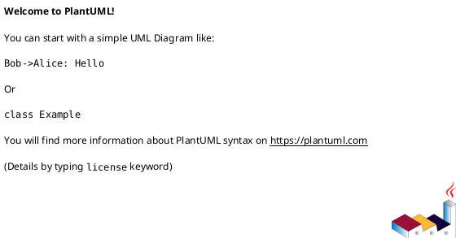

#### Comentarios
```plantuml
' Comentario de línea
/' Comentario
   de múltiples
   líneas '/
```

#### Directivas Comunes
```plantuml
@startuml
!theme amiga
scale 1.5
left to right direction
skinparam backgroundColor #EEEEEE
@enduml
```

### Personalización y Estilos

#### Colores y Estilos
```plantuml
@startuml
skinparam class {
    BackgroundColor PaleGreen
    ArrowColor SeaGreen
    BorderColor SpringGreen
}

skinparam stereotype {
    ABackgroundColor YellowGreen
    CBackgroundColor YellowGreen
}

class Usuario <<entity>> {
    +nombre: String
}
@enduml
```

#### Temas Predefinidos
```plantuml
@startuml
!theme toy
' o también: amiga, blueprint, cerulean, cyborg, mars, etc.
@enduml
```

### Integración con Herramientas

#### Visual Studio Code
- Extensión: "PlantUML"
- Preview en tiempo real
- Exportación automática

#### IntelliJ IDEA
- Plugin: "PlantUML integration"
- Generación desde código
- Visualización integrada

#### Confluence/Wiki
- Macro PlantUML
- Renderizado automático
- Versionado de diagramas

---

## Metodología de Análisis con UML

### Proceso de Análisis y Diseño

#### Fase 1: Análisis de Requisitos
1. **Identificar Actores**
   - Usuarios directos del sistema
   - Sistemas externos
   - Administradores

2. **Definir Casos de Uso**
   - Funcionalidades principales
   - Flujos alternativos
   - Excepciones

3. **Crear Diagrama de Casos de Uso**

#### Fase 2: Análisis de Dominio
1. **Identificar Conceptos del Negocio**
   - Entidades principales
   - Atributos relevantes
   - Relaciones entre entidades

2. **Crear Diagrama de Clases Conceptual**
   - Solo clases y relaciones
   - Sin métodos técnicos
   - Enfoque en el dominio

#### Fase 3: Diseño de Interacciones
1. **Especificar Escenarios**
   - Flujos típicos
   - Casos excepcionales
   - Variaciones importantes

2. **Crear Diagramas de Secuencia**
   - Por cada caso de uso principal
   - Identificar objetos participantes
   - Definir mensajes intercambiados

#### Fase 4: Diseño Detallado
1. **Refinar Diagrama de Clases**
   - Agregar métodos
   - Definir tipos de datos
   - Especificar visibilidad

2. **Diseñar Arquitectura**
   - Diagrama de componentes
   - Diagrama de despliegue
   - Patrones arquitectónicos

### Plantillas de Documentación

#### Template de Caso de Uso
```markdown
**ID:** CU001
**Nombre:** Registrar Usuario
**Actor Principal:** Usuario no registrado
**Precondiciones:** 
- El usuario accede al sistema
- La conexión a internet está disponible

**Flujo Principal:**
1. El usuario selecciona "Registrarse"
2. El sistema muestra formulario de registro
3. El usuario completa los datos requeridos
4. El sistema valida la información
5. El sistema crea la cuenta
6. El sistema envía email de confirmación

**Flujos Alternativos:**
**4a.** Datos inválidos:
  1. El sistema muestra mensajes de error
  2. Regresa al paso 3

**Postcondiciones:**
- Usuario registrado en el sistema
- Email de confirmación enviado
```

#### Template de Clase
```markdown
**Nombre:** Usuario
**Responsabilidades:**
- Mantener información personal del usuario
- Validar credenciales de acceso
- Gestionar preferencias personales

**Atributos:**
- id: Long (identificador único)
- nombre: String (nombre completo)
- email: String (correo electrónico)
- fechaRegistro: Date (fecha de alta)

**Métodos:**
- validarCredenciales(password: String): boolean
- actualizarPerfil(datos: PerfilDTO): void
- obtenerPreferencias(): PreferenciasDTO
```

---

## Buenas Prácticas

### Modelado Efectivo

#### 1. Principios Generales
- **Simplicidad**: Mantener diagramas comprensibles
- **Consistencia**: Usar convenciones uniformes
- **Precisión**: Ser exacto en las relaciones
- **Completitud**: Incluir elementos relevantes

#### 2. Nomenclatura
```plantuml
' ✅ BIEN
class UsuarioRegistrado {
    -numeroIdentificacion: String
    +obtenerDatosPersonales(): DatosPersonales
}

' ❌ MAL
class usr {
    -id: String
    +getData(): Object
}
```

#### 3. Organización Visual
- Agrupar elementos relacionados
- Usar colores consistentemente
- Mantener layout ordenado
- Evitar cruces de líneas innecesarios

### Gestión de Modelos

#### Versionado
- Usar control de versiones (Git)
- Documentar cambios importantes
- Mantener trazabilidad con requisitos

#### Colaboración
- Establecer convenciones de equipo
- Revisar modelos en equipo
- Mantener documentación actualizada

#### Herramientas Complementarias
- **Enterprise Architect**: Modelado profesional
- **StarUML**: Alternativa open source
- **Draw.io**: Diagramas web simples
- **Lucidchart**: Colaboración online

### Errores Comunes a Evitar

#### 1. Sobremodeling
```plantuml
' ❌ MAL - Demasiado detalle para análisis inicial
class Usuario {
    -id: Long {unique}
    -nombre: String {not null, max 100}
    -email: String {not null, email format}
    -passwordHash: String {not null, encrypted}
    -salt: String {not null}
    -fechaCreacion: Timestamp {default now()}
    -fechaUltimaModificacion: Timestamp
    -intentosFallidos: Integer {default 0}
    -cuentaBloqueada: Boolean {default false}
    
    +validarPassword(password: String): Boolean
    +hashPassword(password: String): String
    +generarSalt(): String
    +bloquearCuenta(): void
    +desbloquearCuenta(): void
    +incrementarIntentosFallidos(): void
    +resetearIntentosFallidos(): void
}
```

#### 2. Relaciones Ambiguas
```plantuml
' ❌ MAL - Relación sin especificar
class Persona
class Empresa
Persona -- Empresa

' ✅ BIEN - Relación específica
class Persona
class Empresa
Persona "empleado" --> "empleador" Empresa : trabaja en
```

#### 3. Diagramas Sobrecargados
- Máximo 7-12 clases por diagrama
- Dividir en múltiples vistas si es necesario
- Usar diagramas de paquetes para organizar

---

## Casos de Estudio

### Caso 1: Sistema de Biblioteca

#### Análisis de Requisitos
**Actores identificados:**
- Bibliotecario
- Usuario/Lector
- Sistema externo de multas

**Casos de uso principales:**
- Registrar libro
- Prestar libro
- Devolver libro
- Buscar libro
- Gestionar usuarios

#### Diagrama de Casos de Uso
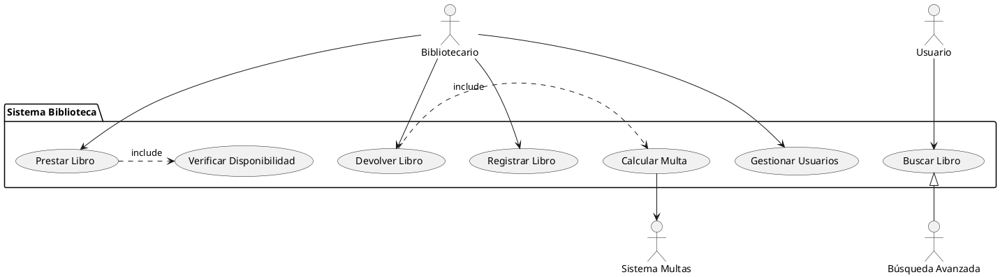

#### Modelo de Dominio
```plantuml
@startuml ModeloBiblioteca
class Usuario {
    -codigo: String
    -nombre: String
    -telefono: String
    -email: String
    -fechaRegistro: Date
    -estado: EstadoUsuario
}

class Libro {
    -isbn: String
    -titulo: String
    -autor: String
    -editorial: String
    -anioPublicacion: int
    -categoria: Categoria
}

class EjemplarLibro {
    -numeroEjemplar: String
    -estado: EstadoEjemplar
    -ubicacion: String
    -fechaAdquisicion: Date
}

class Prestamo {
    -numeroPrestamo: String
    -fechaPrestamo: Date
    -fechaVencimiento: Date
    -fechaDevolucion: Date
    -estado: EstadoPrestamo
}

class Multa {
    -numeroMulta: String
    -monto: double
    -fechaGeneracion: Date
    -fechaPago: Date
    -motivo: String
}

enum EstadoUsuario {
    ACTIVO
    SUSPENDIDO
    INACTIVO
}

enum EstadoEjemplar {
    DISPONIBLE
    PRESTADO
    MANTENIMIENTO
    PERDIDO
}

enum EstadoPrestamo {
    ACTIVO
    DEVUELTO
    VENCIDO
}

Usuario "1" -- "0..*" Prestamo
Prestamo "1" -- "1" EjemplarLibro
Libro "1" -- "1..*" EjemplarLibro
Prestamo "1" -- "0..1" Multa

@enduml
```

#### Diagrama de Secuencia - Prestar Libro
```plantuml
@startuml SecuenciaPrestar
actor Bibliotecario as bib
participant "Sistema" as sys
participant "ControladorPrestamo" as ctrl
participant "ServicioPrestamo" as serv
participant "RepositorioUsuario" as repoUser
participant "RepositorioEjemplar" as repoEjem

bib -> sys: prestarLibro(codigoUsuario, numeroEjemplar)
sys -> ctrl: procesarPrestamo(codigoUsuario, numeroEjemplar)

ctrl -> repoUser: buscarUsuario(codigoUsuario)
repoUser --> ctrl: usuario

ctrl -> repoEjem: buscarEjemplar(numeroEjemplar)
repoEjem --> ctrl: ejemplar

ctrl -> serv: validarPrestamo(usuario, ejemplar)

alt usuario y ejemplar válidos
    serv -> serv: crearPrestamo()
    serv -> repoEjem: actualizarEstado(numeroEjemplar, PRESTADO)
    serv --> ctrl: prestamo creado
    ctrl --> sys: éxito
    sys --> bib: préstamo realizado
else validación falla
    serv --> ctrl: error validación
    ctrl --> sys: mensaje error
    sys --> bib: mostrar error
end
@enduml
```

### Caso 2: Sistema de E-commerce

#### Diagrama de Componentes
```plantuml
@startuml ComponentesEcommerce
package "Frontend" {
    component [Aplicación Web] as web
    component [Aplicación Móvil] as mobile
}

package "API Gateway" {
    component [Gateway] as gateway
    component [Autenticación] as auth
    component [Rate Limiting] as rate
}

package "Microservicios" {
    component [Servicio Usuario] as userSvc
    component [Servicio Producto] as prodSvc
    component [Servicio Pedido] as orderSvc
    component [Servicio Pago] as paySvc
    component [Servicio Inventario] as invSvc
}

package "Datos" {
    database [DB Usuarios] as userDb
    database [DB Productos] as prodDb
    database [DB Pedidos] as orderDb
    database [Cache Redis] as cache
}

package "Servicios Externos" {
    component [Pasarela Pago] as payGw
    component [Servicio Envío] as shipping
}

web --> gateway
mobile --> gateway

gateway --> auth
gateway --> rate
gateway --> userSvc
gateway --> prodSvc
gateway --> orderSvc

userSvc --> userDb
prodSvc --> prodDb
prodSvc --> cache
orderSvc --> orderDb
orderSvc --> paySvc
orderSvc --> invSvc

paySvc --> payGw
orderSvc --> shipping

invSvc --> prodDb
@enduml
```

---

## Referencias y Recursos

### Documentación Oficial
- **OMG UML Specification**: [https://www.omg.org/spec/UML/](https://www.omg.org/spec/UML/)
- **PlantUML Documentation**: [https://plantuml.com/](https://plantuml.com/)

### Libros Recomendados
1. **"UML Distilled" - Martin Fowler**
   - Enfoque práctico y conciso
   - Ideal para análisis rápido

2. **"Applying UML and Patterns" - Craig Larman**
   - Metodología completa
   - Análisis y diseño orientado a objetos

3. **"The Unified Modeling Language User Guide" - Booch, Rumbaugh, Jacobson**
   - Guía definitiva de los creadores
   - Referencia completa

4. **"UML 2 Toolkit" - Hans-Erik Eriksson**
   - Herramientas y técnicas avanzadas
   - Casos de uso complejos

### Herramientas de Modelado

#### Comerciales
- **Enterprise Architect** (Sparx Systems)
  - Modelado profesional completo
  - Generación de código
  - Gestión de requisitos

- **MagicDraw** (No Magic)
  - Soporte completo UML 2.x
  - Colaboración en equipo
  - Plugins especializados

- **Visual Paradigm**
  - Interface intuitiva
  - Integración con IDEs
  - Documentación automática

#### Gratuitas/Open Source
- **StarUML**
  - Modelado UML básico
  - Extensible con plugins
  - Multiplataforma

- **ArgoUML**
  - Java-based
  - Validación de modelos
  - Generación de código

- **Umbrello** (KDE)
  - Linux nativo
  - Integración con desarrollo

#### Online
- **Draw.io/Diagrams.net**
  - Colaboración en tiempo real
  - Integración con Google Drive
  - Plantillas predefinidas

- **Lucidchart**
  - Colaboración profesional
  - Integración empresarial
  - Plantillas especializadas

- **PlantText** (planttext.com)
  - Editor PlantUML online
  - Vista previa instantánea
  - Compartir diagramas

### Extensiones y Plugins

#### Visual Studio Code
```bash
# Extensiones recomendadas
PlantUML
UML Preview
Markdown Preview Enhanced
```

#### IntelliJ IDEA/PyCharm
```bash
# Plugins útiles
PlantUML integration
UML Support
Sequence Diagram
```

#### Eclipse
```bash
# Plugins recomendados
Papyrus UML
PlantUML Eclipse Plugin
EMF (Eclipse Modeling Framework)
```

---

## Patrones de Diseño en UML

### Patrones Creacionales

#### Singleton
```plantuml
@startuml Singleton
class DatabaseConnection {
    {static} -instance: DatabaseConnection
    -connection: Connection
    
    -DatabaseConnection()
    {static} +getInstance(): DatabaseConnection
    +getConnection(): Connection
    +closeConnection(): void
}

note right of DatabaseConnection::getInstance
    if (instance == null) {
        instance = new DatabaseConnection();
    }
    return instance;
end note
@enduml
```

#### Factory Method
```plantuml
@startuml FactoryMethod
abstract class DocumentFactory {
    +{abstract} createDocument(): Document
    +openDocument(): void
}

class PDFFactory {
    +createDocument(): Document
}

class WordFactory {
    +createDocument(): Document
}

abstract class Document {
    +{abstract} open(): void
    +{abstract} save(): void
}

class PDFDocument {
    +open(): void
    +save(): void
}

class WordDocument {
    +open(): void
    +save(): void
}

DocumentFactory <|-- PDFFactory
DocumentFactory <|-- WordFactory
Document <|-- PDFDocument
Document <|-- WordDocument

PDFFactory ..> PDFDocument : creates
WordFactory ..> WordDocument : creates
@enduml
```

### Patrones Estructurales

#### Adapter
```plantuml
@startuml Adapter
interface Target {
    +request(): void
}

class Client {
    +operation(): void
}

class Adapter {
    -adaptee: Adaptee
    +request(): void
}

class Adaptee {
    +specificRequest(): void
}

Client --> Target
Target <|.. Adapter
Adapter --> Adaptee

note right of Adapter::request
    adaptee.specificRequest();
end note
@enduml
```

#### Composite
```plantuml
@startuml Composite
abstract class Component {
    #name: String
    +{abstract} operation(): void
    +add(Component): void
    +remove(Component): void
    +getChild(int): Component
}

class Leaf {
    +operation(): void
}

class Composite {
    -children: List<Component>
    +operation(): void
    +add(Component): void
    +remove(Component): void
    +getChild(int): Component
}

Component <|-- Leaf
Component <|-- Composite
Composite "1" *-- "0..*" Component : children
@enduml
```

### Patrones de Comportamiento

#### Observer
```plantuml
@startuml Observer
interface Subject {
    +attach(Observer): void
    +detach(Observer): void
    +notify(): void
}

interface Observer {
    +update(): void
}

class ConcreteSubject {
    -state: String
    -observers: List<Observer>
    
    +attach(Observer): void
    +detach(Observer): void
    +notify(): void
    +getState(): String
    +setState(String): void
}

class ConcreteObserver {
    -subject: ConcreteSubject
    -observerState: String
    
    +update(): void
}

Subject <|.. ConcreteSubject
Observer <|.. ConcreteObserver
ConcreteSubject "1" --> "0..*" Observer : observers
ConcreteObserver --> ConcreteSubject : subject
@enduml
```

#### Strategy
```plantuml
@startuml Strategy
class Context {
    -strategy: Strategy
    +setStrategy(Strategy): void
    +executeStrategy(): void
}

interface Strategy {
    +execute(): void
}

class ConcreteStrategyA {
    +execute(): void
}

class ConcreteStrategyB {
    +execute(): void
}

class ConcreteStrategyC {
    +execute(): void
}

Context --> Strategy
Strategy <|.. ConcreteStrategyA
Strategy <|.. ConcreteStrategyB
Strategy <|.. ConcreteStrategyC
@enduml
```

---

## Modelado de Arquitecturas

### Arquitectura en Capas
```plantuml
@startuml ArquitecturaCapas
package "Capa de Presentación" as presentation {
    class UsuarioController
    class ProductoController
    class PedidoController
}

package "Capa de Aplicación" as application {
    class UsuarioService
    class ProductoService
    class PedidoService
}

package "Capa de Dominio" as domain {
    class Usuario
    class Producto
    class Pedido
    class ReglasNegocio
}

package "Capa de Infraestructura" as infrastructure {
    interface UsuarioRepository
    interface ProductoRepository
    interface PedidoRepository
    
    class UsuarioRepositoryImpl
    class ProductoRepositoryImpl
    class PedidoRepositoryImpl
}

package "Capa de Datos" as data {
    database PostgreSQL
    database Redis
    component "Sistema Externo" as external
}

' Dependencias
UsuarioController --> UsuarioService
ProductoController --> ProductoService
PedidoController --> PedidoService

UsuarioService --> Usuario
UsuarioService --> UsuarioRepository
ProductoService --> Producto
ProductoService --> ProductoRepository
PedidoService --> Pedido
PedidoService --> PedidoRepository

UsuarioRepository <|.. UsuarioRepositoryImpl
ProductoRepository <|.. ProductoRepositoryImpl
PedidoRepository <|.. PedidoRepositoryImpl

UsuarioRepositoryImpl --> PostgreSQL
ProductoRepositoryImpl --> PostgreSQL
PedidoRepositoryImpl --> PostgreSQL
PedidoRepositoryImpl --> Redis
PedidoRepositoryImpl --> external
@enduml
```

### Arquitectura de Microservicios
```plantuml
@startuml Microservicios
!define RECTANGLE class

package "Cliente" {
    RECTANGLE [Web App] as webapp
    RECTANGLE [Mobile App] as mobile
}

package "API Gateway" {
    RECTANGLE [Load Balancer] as lb
    RECTANGLE [Authentication] as auth
    RECTANGLE [Rate Limiter] as rate
}

package "Microservicios de Negocio" {
    RECTANGLE [User Service] as user {
        database [User DB]
    }
    
    RECTANGLE [Product Service] as product {
        database [Product DB]
        database [Product Cache]
    }
    
    RECTANGLE [Order Service] as order {
        database [Order DB]
        queue [Order Queue]
    }
    
    RECTANGLE [Payment Service] as payment {
        database [Payment DB]
    }
    
    RECTANGLE [Inventory Service] as inventory {
        database [Inventory DB]
    }
}

package "Servicios de Infraestructura" {
    RECTANGLE [Config Service] as config
    RECTANGLE [Discovery Service] as discovery
    RECTANGLE [Monitoring] as monitor
    RECTANGLE [Logging] as logging
}

package "Servicios Externos" {
    RECTANGLE [Payment Gateway] as paygw
    RECTANGLE [Email Service] as email
    RECTANGLE [SMS Service] as sms
}

' Conexiones
webapp --> lb
mobile --> lb

lb --> auth
lb --> rate
lb --> user
lb --> product
lb --> order

auth --> user
order --> payment
order --> inventory
order --> user
order --> product

payment --> paygw
order --> email
order --> sms

user --> config
product --> config
order --> config
payment --> config

user --> discovery
product --> discovery
order --> discovery
payment --> discovery

user --> monitor
product --> monitor
order --> monitor
payment --> monitor

user --> logging
product --> logging
order --> logging
payment --> logging
@enduml
```

### Arquitectura Hexagonal (Ports and Adapters)
```plantuml
@startuml ArquitecturaHexagonal
package "Dominio" {
    class Usuario {
        -id: UserId
        -nombre: String
        -email: Email
        +cambiarEmail(Email): void
        +validar(): boolean
    }
    
    class Email {
        -valor: String
        +Email(String)
        +esValido(): boolean
    }
    
    interface UsuarioRepository {
        +guardar(Usuario): void
        +buscarPorId(UserId): Usuario
        +buscarPorEmail(Email): Usuario
    }
    
    class UsuarioService {
        +registrarUsuario(DatosUsuario): Usuario
        +actualizarEmail(UserId, Email): void
    }
}

package "Puertos Primarios" {
    interface UsuarioUseCase {
        +registrar(DatosRegistro): UsuarioDto
        +actualizar(UserId, DatosActualizacion): void
    }
}

package "Adaptadores Primarios" {
    class UsuarioRestController {
        +post("/usuarios"): ResponseEntity
        +put("/usuarios/{id}"): ResponseEntity
    }
    
    class UsuarioGraphQLResolver {
        +crearUsuario(input): Usuario
        +actualizarUsuario(id, input): Usuario
    }
}

package "Adaptadores Secundarios" {
    class UsuarioJpaRepository {
        +save(UsuarioEntity): void
        +findById(Long): Optional<UsuarioEntity>
        +findByEmail(String): Optional<UsuarioEntity>
    }
    
    class UsuarioMongoRepository {
        +save(UsuarioDocument): void
        +findById(String): Optional<UsuarioDocument>
    }
    
    class EmailServiceImpl {
        +enviarBienvenida(Email): void
        +enviarConfirmacion(Email): void
    }
}

' Implementaciones
UsuarioUseCase <|.. UsuarioService
UsuarioRepository <|.. UsuarioJpaRepository
UsuarioRepository <|.. UsuarioMongoRepository

' Dependencias
UsuarioRestController --> UsuarioUseCase
UsuarioGraphQLResolver --> UsuarioUseCase
UsuarioService --> UsuarioRepository
UsuarioService --> Usuario
Usuario --> Email
@enduml
```

---

## Técnicas Avanzadas de Modelado

### Estereotipos y Perfiles UML

#### Definición de Estereotipos Personalizados
```plantuml
@startuml Estereotipos
!define ENTITY_COLOR #E1F5FE
!define SERVICE_COLOR #FFF3E0
!define REPOSITORY_COLOR #F3E5F5

class Usuario <<entity>> ENTITY_COLOR {
    -id: Long
    -nombre: String
    -email: String
}

class UsuarioService <<service>> SERVICE_COLOR {
    +crearUsuario(datos): Usuario
    +buscarPorId(id): Usuario
}

class UsuarioRepository <<repository>> REPOSITORY_COLOR {
    +save(usuario): void
    +findById(id): Optional<Usuario>
}

interface EventPublisher <<interface>> {
    +publish(event): void
}

class UsuarioCreatedEvent <<event>> {
    -usuarioId: Long
    -timestamp: LocalDateTime
}

UsuarioService --> UsuarioRepository
UsuarioService --> EventPublisher
UsuarioService ..> UsuarioCreatedEvent : creates
@enduml
```

#### Perfil para Arquitectura DDD
```plantuml
@startuml PerfilDDD
package "Aggregate Root" <<aggregate>> {
    class Pedido <<aggregate root>> {
        -id: PedidoId
        -items: List<ItemPedido>
        -estado: EstadoPedido
        
        +agregarItem(producto, cantidad): void
        +calcularTotal(): Money
        +confirmar(): DomainEvent[]
    }
    
    class ItemPedido <<value object>> {
        -producto: Producto
        -cantidad: int
        -precio: Money
        
        +calcularSubtotal(): Money
    }
}

class PedidoRepository <<repository>> {
    +save(pedido): void
    +findById(id): Optional<Pedido>
}

class PedidoService <<domain service>> {
    +calcularDescuento(pedido): Money
    +validarDisponibilidad(items): boolean
}

interface PedidoUseCase <<use case>> {
    +crearPedido(command): PedidoId
    +confirmarPedido(id): void
}

Pedido "1" *-- "1..*" ItemPedido
PedidoService --> PedidoRepository
PedidoUseCase --> PedidoService
@enduml
```

### Modelado de Eventos y CQRS

#### Event Sourcing
```plantuml
@startuml EventSourcing
class CuentaBancaria <<aggregate root>> {
    -id: CuentaId
    -saldo: Money
    -version: long
    
    +depositar(monto): void
    +retirar(monto): void
    +aplicarEvento(evento): void
}

abstract class DomainEvent {
    -agregadoId: String
    -version: long
    -timestamp: LocalDateTime
}

class CuentaCreada {
    -titularCuenta: String
    -saldoInicial: Money
}

class DepositoRealizado {
    -monto: Money
    -descripcion: String
}

class RetiroRealizado {
    -monto: Money
    -descripcion: String
}

class EventStore <<repository>> {
    +guardarEventos(agregadoId, eventos): void
    +obtenerEventos(agregadoId): List<DomainEvent>
    +obtenerSnapshot(agregadoId): Optional<Snapshot>
}

interface EventPublisher <<service>> {
    +publicar(eventos): void
}

DomainEvent <|-- CuentaCreada
DomainEvent <|-- DepositoRealizado
DomainEvent <|-- RetiroRealizado

CuentaBancaria ..> DomainEvent : produces
EventStore --> DomainEvent
EventPublisher --> DomainEvent
@enduml
```

#### CQRS (Command Query Responsibility Segregation)
```plantuml
@startuml CQRS
package "Command Side" {
    interface CommandHandler {
        +handle(command): void
    }
    
    class CrearPedidoHandler {
        +handle(CrearPedidoCommand): void
    }
    
    class CrearPedidoCommand {
        -clienteId: String
        -items: List<ItemCommand>
    }
    
    class WriteModel {
        +pedidos: PedidoRepository
        +productos: ProductoRepository
    }
}

package "Query Side" {
    interface QueryHandler {
        +handle(query): Result
    }
    
    class BuscarPedidosHandler {
        +handle(BuscarPedidosQuery): List<PedidoView>
    }
    
    class BuscarPedidosQuery {
        -clienteId: String
        -fechaDesde: LocalDate
        -fechaHasta: LocalDate
    }
    
    class ReadModel {
        +pedidosView: PedidoViewRepository
        +resumenesView: ResumenViewRepository
    }
    
    class PedidoView {
        -id: String
        -clienteNombre: String
        -total: BigDecimal
        -estado: String
        -fechaCreacion: LocalDateTime
    }
}

package "Events" {
    class PedidoCreado {
        -pedidoId: String
        -clienteId: String
        -items: List<Item>
        -total: BigDecimal
    }
    
    interface EventHandler {
        +handle(event): void
    }
    
    class PedidoViewUpdater {
        +handle(PedidoCreado): void
    }
}

CommandHandler <|.. CrearPedidoHandler
QueryHandler <|.. BuscarPedidosHandler
EventHandler <|.. PedidoViewUpdater

CrearPedidoHandler --> WriteModel
BuscarPedidosHandler --> ReadModel
PedidoViewUpdater --> ReadModel

CrearPedidoHandler ..> PedidoCreado : publishes
PedidoViewUpdater <-- PedidoCreado : subscribes
@enduml
```

---

## Generación de Código desde UML

### Configuración para Generación Java

#### Anotaciones en PlantUML
```plantuml
@startuml GeneracionJava
class Usuario {
    -id: Long {id}
    -nombre: String {required, maxLength=100}
    -email: String {required, unique}
    -fechaCreacion: LocalDateTime {generated}
    
    +Usuario() {constructor}
    +Usuario(nombre: String, email: String) {constructor}
    +getNombre(): String {getter}
    +setNombre(nombre: String): void {setter}
    +validarEmail(): boolean {validation}
}

class UsuarioRepository {
    +save(usuario: Usuario): Usuario {persist}
    +findById(id: Long): Optional<Usuario> {query}
    +findByEmail(email: String): Optional<Usuario> {query, unique}
    +findAll(): List<Usuario> {query}
    +deleteById(id: Long): void {delete}
}

interface UsuarioService {
    +crearUsuario(datos: DatosUsuario): Usuario {service}
    +actualizarUsuario(id: Long, datos: DatosUsuario): Usuario {service}
    +buscarPorId(id: Long): Usuario {service}
    +eliminarUsuario(id: Long): void {service}
}

Usuario --> UsuarioRepository
UsuarioService --> UsuarioRepository
@enduml
```

#### Plantilla de Generación JPA
```java
// Generado desde diagrama UML
@Entity
@Table(name = "usuarios")
public class Usuario {
    
    @Id
    @GeneratedValue(strategy = GenerationType.IDENTITY)
    private Long id;
    
    @Column(nullable = false, length = 100)
    private String nombre;
    
    @Column(nullable = false, unique = true)
    private String email;
    
    @Column(name = "fecha_creacion")
    @CreationTimestamp
    private LocalDateTime fechaCreacion;
    
    // Constructors
    public Usuario() {}
    
    public Usuario(String nombre, String email) {
        this.nombre = nombre;
        this.email = email;
    }
    
    // Getters and Setters
    public String getNombre() {
        return nombre;
    }
    
    public void setNombre(String nombre) {
        this.nombre = nombre;
    }
    
    // Validation methods
    public boolean validarEmail() {
        return email != null && email.matches("^[\\w-\\.]+@[\\w-]+\\.[a-z]{2,}$");
    }
}
```

### Generación de API REST

#### Especificación OpenAPI desde UML
```yaml
# Generado desde diagrama de casos de uso
openapi: 3.0.0
info:
  title: API Usuario
  version: 1.0.0
  description: API generada desde modelo UML

paths:
  /usuarios:
    post:
      summary: Crear usuario
      operationId: crearUsuario
      requestBody:
        required: true
        content:
          application/json:
            schema:
              $ref: '#/components/schemas/DatosUsuario'
      responses:
        '201':
          description: Usuario creado exitosamente
          content:
            application/json:
              schema:
                $ref: '#/components/schemas/Usuario'
    
    get:
      summary: Listar usuarios
      operationId: listarUsuarios
      parameters:
        - name: page
          in: query
          schema:
            type: integer
            default: 0
        - name: size
          in: query
          schema:
            type: integer
            default: 20
      responses:
        '200':
          description: Lista de usuarios
          content:
            application/json:
              schema:
                type: array
                items:
                  $ref: '#/components/schemas/Usuario'

components:
  schemas:
    Usuario:
      type: object
      properties:
        id:
          type: integer
          format: int64
        nombre:
          type: string
          maxLength: 100
        email:
          type: string
          format: email
        fechaCreacion:
          type: string
          format: date-time
```

---

## Testing y Validación de Modelos

### Validación de Modelos UML

#### Reglas de Validación
```plantuml
@startuml ValidacionModelo
class ValidadorModelo {
    +validarConsistencia(): List<ErrorValidacion>
    +validarCompletitud(): List<AdvertenciaValidacion>
    +validarConvenciones(): List<SugerenciaValidacion>
}

class ErrorValidacion {
    -tipo: TipoError
    -elemento: String
    -descripcion: String
    -severidad: Severidad
}

class ReglasValidacion {
    +validarNombratura(): boolean
    +validarRelaciones(): boolean
    +validarMultiplicidades(): boolean
    +validarHerencia(): boolean
}

enum TipoError {
    RELACION_INVALIDA
    MULTIPLICIDAD_INCORRECTA
    HERENCIA_CIRCULAR
    NOMENCLATURA_INCORRECTA
    ATRIBUTO_DUPLICADO
}

ValidadorModelo --> ErrorValidacion
ValidadorModelo --> ReglasValidacion
ErrorValidacion --> TipoError
@enduml
```

### Test de Integración de Modelos

#### Verificación de Consistencia
```java
public class TestConsistenciaModelo {
    
    @Test
    public void verificarRelacionesBidireccionales() {
        // Verificar que todas las asociaciones bidireccionales
        // estén correctamente definidas en ambas direcciones
        
        Clase usuario = modelo.getClase("Usuario");
        Clase pedido = modelo.getClase("Pedido");
        
        Relacion usuarioPedido = usuario.getRelacion("pedidos");
        Relacion pedidoUsuario = pedido.getRelacion("usuario");
        
        assertThat(usuarioPedido.getDestino()).isEqualTo(pedido);
        assertThat(pedidoUsuario.getDestino()).isEqualTo(usuario);
        assertThat(usuarioPedido.esBidireccional()).isTrue();
    }
    
    @Test
    public void verificarMultiplicidades() {
        // Verificar que las multiplicidades sean consistentes
        
        Relacion usuarioPedidos = modelo.getRelacion("Usuario", "Pedido");
        assertThat(usuarioPedidos.getMultiplicidadOrigen()).isEqualTo("1");
        assertThat(usuarioPedidos.getMultiplicidadDestino()).isEqualTo("0..*");
    }
    
    @Test
    public void verificarHerenciaCircular() {
        // Verificar que no existan ciclos en la jerarquía de herencia
        
        ValidadorJerarquia validador = new ValidadorJerarquia();
        List<ErrorValidacion> errores = validador.validar(modelo);
        
        assertThat(errores)
            .filteredOn(error -> error.getTipo() == HERENCIA_CIRCULAR)
            .isEmpty();
    }
}
```

---

## Conclusión

Este manual proporciona una base sólida para el uso efectivo de UML en el análisis de sistemas. Los puntos clave para recordar son:

### Principios Fundamentales
1. **UML es un lenguaje**, no una metodología
2. **La comunicación es el objetivo principal**
3. **No todos los diagramas son necesarios siempre**
4. **La precisión es más importante que la perfección**

### Recomendaciones para Analistas
- Comenzar con diagramas simples y evolucionar gradualmente
- Mantener los modelos actualizados con los cambios del sistema
- Usar herramientas que faciliten la colaboración del equipo
- Documentar las decisiones de diseño importantes

### Evolución Continua
- Mantenerse actualizado con las nuevas versiones de UML
- Explorar herramientas emergentes de modelado
- Adaptar las técnicas a las necesidades específicas del proyecto
- Compartir conocimiento y experiencias con la comunidad

El dominio de UML es un proceso continuo que se perfecciona con la práctica. Este manual debe servir como referencia constante en el desarrollo de proyectos de software, adaptando las técnicas y herramientas a las necesidades específicas de cada contexto.

---

*Manual creado para analistas de sistemas - Versión 1.0*
*Última actualización: Agosto 2025*